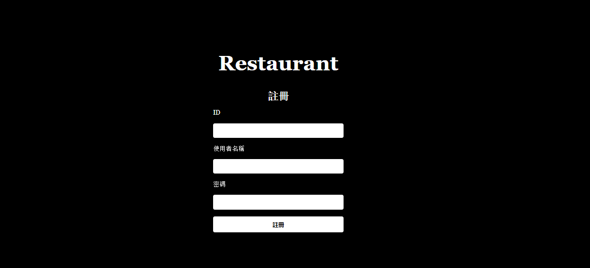
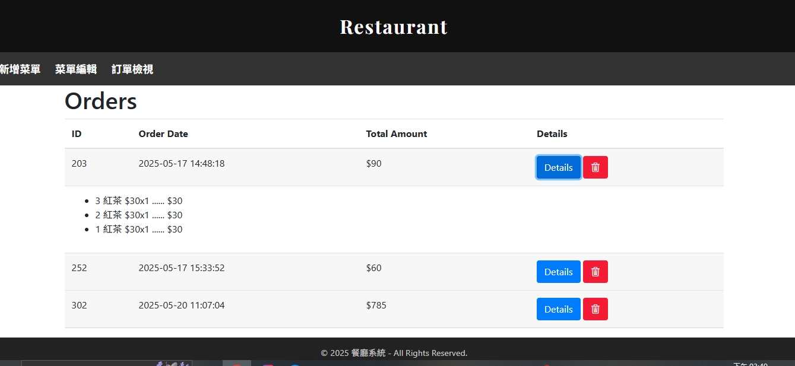
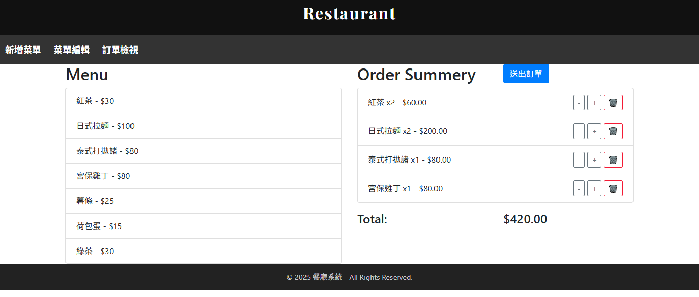
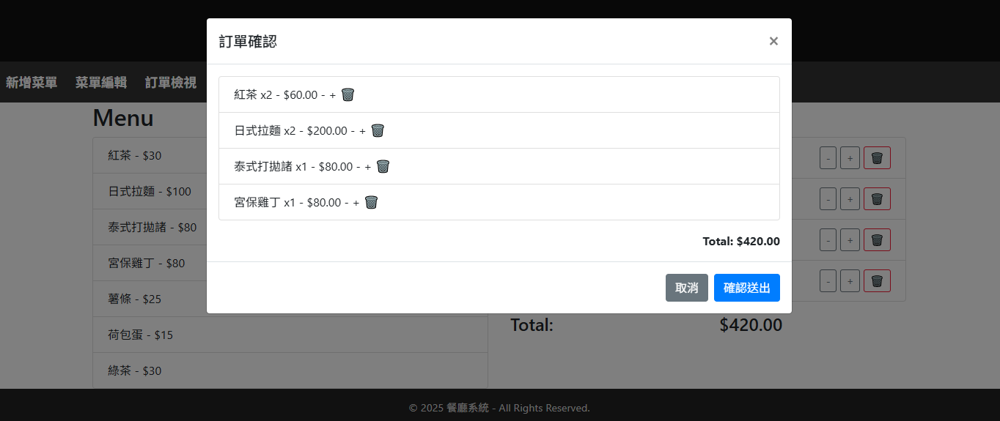
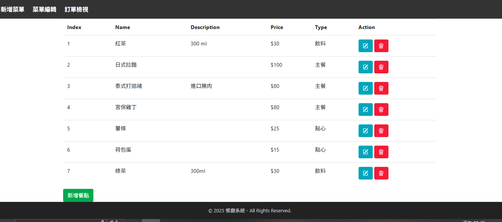

# Restaurant


# Restaurant Ordering System 🍽️

## 主要功能

- 菜單管理（新增、編輯、刪除餐點與餐點類別）


- 即時點餐介面，能選擇餐點並調整數量


- 訂單總價自動計算


- 訂單送出與簡易訂單確認


---

## 🔧 技術棧

- **Spring Boot 3.4.5**
- **Thymeleaf** + Thymeleaf Layout Dialect
- **Spring Data JPA**
- **PostgreSQL**
- **Maven**
- **Lombok**
- **Docker** 

---

## 📁 專案結構簡介

```
src/
├── main/
│   ├── java/com/order/Restarant/
│   │   ├── controller/     # 控制器 (MVC)
│   │   ├── entity/         # 資料模型
│   │   ├── repository/     # JPA Repository
│   │   └── RestarantApplication.java
│   └── resources/
│       ├── templates/      # Thymeleaf HTML 模板
│       ├── static/         # 靜態資源 (CSS, JS)
│       └── application.properties
```
---

## 如何執行
- 使用 Maven 打包：

``` mvn clean install -DskipTests```

- 啟動專案

``` java -jar target/Restarant-0.0.1-SNAPSHOT.jar```

或在 IDE 中執行 RestarantApplication.java

##  預設路徑
註冊/register

首頁	/login

訂單建立	/order ->/order/create

菜單瀏覽	/dishes-edit

餐點管理	/dishes

##  備註
- 若在 CI/CD 中遇到測試錯誤，可使用 -DskipTests 跳過。

- 使用 PostgreSQL 資料庫，請在 application.properties 中配置連線資訊。

- 若需使用 Docker，可自建 Dockerfile 及 docker-compose.yml。

## 📸 預覽畫面 

### 登入頁面




### 登入頁面


### 訂單檢視



### 訂單建立頁面


### 訂單確認 

### 菜單管理



## 📜 授權
本專案僅作為展示用途，未進行授權約束。